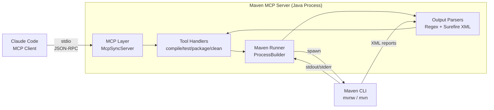

# Maven MCP Server — Technical Specification

**Version:** 1.0
**Date:** 2026-02-14
**Status:** Approved
**Author:** Architect (based on REQUIREMENTS.md v1.0)

---

## 1. Overview

Maven MCP Server is a Java-based MCP (Model Context Protocol) server that enables Claude Code to autonomously execute Maven operations — compile, test, package, and clean — on single-module Maven projects. The server wraps Maven CLI as a child process, parses its output, and returns structured results (compilation errors with file/line/column, test results with pass/fail/stacktrace, artifact paths) so the AI agent can quickly identify and fix problems without manually interpreting raw Maven logs.

The server communicates with Claude Code via stdio transport (standard MCP) and is built with Maven itself (dogfooding).

## 2. Goals & Non-Goals

### 2.1 Goals

- **Structured error output:** Agent receives compilation errors with file path, line, column, message, and severity — no manual log parsing needed.
- **Structured test results:** Agent receives test summary (run/failed/skipped/errored) with individual failure details (class, method, message, stack trace).
- **Autonomous build cycle:** Agent can independently execute clean → compile → test → package without user intervention.
- **Simple configuration:** Server can be launched with a single line in Claude Code's MCP config.
- **Reliable parsing:** Use Surefire XML reports for test results (not fragile regex on stdout).
- **Fail-fast startup:** Validate project path, pom.xml existence, and Maven availability at server startup.

### 2.2 Non-Goals

- **Multi-module projects:** No support for Maven reactor, `-pl` operations, or module-specific builds.
- **POM management:** No editing of dependencies, versions, or plugins.
- **Gradle or other build tools:** Maven only.
- **GUI / web interface:** CLI-only, stdio transport.
- **Multi-project support:** One server instance = one project.
- **Maven Embedder (in-process):** v1.0 uses CLI wrapper. Embedder is a future evolution path.
- **Windows support:** Linux and macOS only in MVP. Windows is Phase 2.

## 3. Architecture

### 3.1 Architecture Style

**Wrapper CLI — single-process synchronous server.**

The server is a single Java process that:
1. Receives MCP tool calls via stdin (JSON-RPC over stdio).
2. Translates them into Maven CLI invocations via `ProcessBuilder`.
3. Captures Maven's stdout/stderr from the child process.
4. Parses the output into structured data.
5. Returns structured JSON results via stdout (MCP response).

This is the simplest architecture that satisfies all requirements. The synchronous model fits naturally because Maven operations are blocking (one build at a time). The wrapper pattern allows future migration to Maven Embedder without changing the MCP interface.

### 3.2 High-Level Diagram



### 3.3 Component Inventory

#### Bootstrap (`MavenMcpServer`)
- **Responsibility:** Application entry point. Parses CLI arguments (Picocli), validates project directory (pom.xml exists, Maven available), configures logging, creates and starts `McpSyncServer`.
- **Technology:** Java 25+, Picocli 4.7.x
- **Interfaces:**
  - Consumes: CLI arguments (`--project <path>`)
  - Exposes: Running MCP server on stdio

#### Server Config (`ServerConfig`)
- **Responsibility:** Immutable configuration record holding validated settings.
- **Technology:** Java record
- **Interfaces:**
  - Fields: `projectDir` (Path), `mavenExecutable` (Path)

#### Tool Handlers (`CompileTool`, `TestTool`, `PackageTool`, `CleanTool`)
- **Responsibility:** Translate MCP tool parameters into Maven Runner calls, invoke appropriate parsers, build structured `CallToolResult` responses.
- **Technology:** Implements `BiFunction<McpSyncServerExchange, Map<String, Object>, CallToolResult>`
- **Interfaces:**
  - Consumes: MCP tool call arguments (Map)
  - Produces: `CallToolResult` with JSON `TextContent`

#### Maven Runner (`MavenRunner`)
- **Responsibility:** Spawns Maven as a child process, captures stdout and stderr on separate threads, waits for process completion, returns raw results.
- **Technology:** `ProcessBuilder`, `CompletableFuture` for stream consumption
- **Interfaces:**
  - Input: Maven goal (String), extra args (List<String>), project directory (Path)
  - Output: `MavenExecutionResult` (exitCode, stdout, stderr, duration)

#### Maven Detector (`MavenDetector`)
- **Responsibility:** Determines which Maven executable to use. Checks for `./mvnw` in project directory first, falls back to system `mvn` on PATH.
- **Technology:** `java.nio.file.Files`, `ProcessBuilder` (for `which mvn` fallback)
- **Interfaces:**
  - Input: project directory (Path)
  - Output: Maven executable path (Path)
  - Throws: `MavenNotFoundException` if neither found

#### Compilation Output Parser (`CompilationOutputParser`)
- **Responsibility:** Parses Maven/javac stdout for compilation errors and warnings using regex patterns.
- **Technology:** `java.util.regex`
- **Interfaces:**
  - Input: stdout (String)
  - Output: `List<CompilationError>` (errors + warnings separated by severity)

#### Surefire Report Parser (`SurefireReportParser`)
- **Responsibility:** Parses Surefire XML reports from `target/surefire-reports/TEST-*.xml`. Extracts test counts, failures, error messages, and stack traces (truncated to configurable line limit).
- **Technology:** JAXP DOM parser (built into JDK)
- **Interfaces:**
  - Input: project directory (Path), max stack trace lines (int, default 50)
  - Output: `TestResult` with summary and list of `TestFailure`

#### Models (Java Records)
- **Responsibility:** Immutable data carriers for structured results.
- **Technology:** Java records, Jackson-serializable
- See Section 4.1 for details.

## 4. Data Model

### 4.1 Entities

#### `BuildResult`
The top-level response object returned by all tools.

| Field | Type | Constraints | Description |
|-------|------|-------------|-------------|
| `status` | `String` | Enum: `SUCCESS`, `FAILURE`, `TIMEOUT` | Overall operation result |
| `duration` | `long` | ≥ 0, milliseconds | Wall-clock time of Maven execution |
| `errors` | `List<CompilationError>` | Nullable | Compilation errors (severity=ERROR) |
| `warnings` | `List<CompilationError>` | Nullable | Compilation warnings (severity=WARNING) |
| `summary` | `TestSummary` | Nullable | Test execution summary (only for maven_test) |
| `failures` | `List<TestFailure>` | Nullable | Individual test failures (only for maven_test) |
| `artifact` | `ArtifactInfo` | Nullable | Built artifact info (only for maven_package on success) |
| `output` | `String` | Nullable | Raw Maven output (only included on FAILURE) |

**Serialization note:** Null fields are omitted from JSON output to keep responses compact. Each tool only populates the fields relevant to its operation.

#### `CompilationError`

| Field | Type | Constraints | Description |
|-------|------|-------------|-------------|
| `file` | `String` | Relative path | Source file path relative to project root |
| `line` | `int` | ≥ 1 | Line number |
| `column` | `Integer` | Nullable, ≥ 1 | Column number (may not always be present) |
| `message` | `String` | Not blank | Error/warning message |
| `severity` | `String` | Enum: `ERROR`, `WARNING` | Severity level |

#### `TestSummary`

| Field | Type | Constraints | Description |
|-------|------|-------------|-------------|
| `testsRun` | `int` | ≥ 0 | Total tests executed |
| `testsFailed` | `int` | ≥ 0 | Tests with assertion failures |
| `testsSkipped` | `int` | ≥ 0 | Skipped tests |
| `testsErrored` | `int` | ≥ 0 | Tests with unexpected errors |

#### `TestFailure`

| Field | Type | Constraints | Description |
|-------|------|-------------|-------------|
| `testClass` | `String` | FQCN | Fully qualified test class name |
| `testMethod` | `String` | Not blank | Test method name |
| `message` | `String` | Not blank | Failure/error message |
| `stackTrace` | `String` | Nullable, max 50 lines default | Truncated stack trace |

#### `ArtifactInfo`

| Field | Type | Constraints | Description |
|-------|------|-------------|-------------|
| `path` | `String` | Relative path | Artifact path relative to project root |
| `name` | `String` | Not blank | Artifact filename |
| `size` | `long` | ≥ 0, bytes | File size in bytes |

#### `MavenExecutionResult` (internal, not exposed via MCP)

| Field | Type | Description |
|-------|------|-------------|
| `exitCode` | `int` | Process exit code (0 = success) |
| `stdout` | `String` | Captured standard output |
| `stderr` | `String` | Captured standard error |
| `duration` | `long` | Execution time in milliseconds |

### 4.2 Storage

**No persistence.** The server is completely stateless. Maven output is processed in-flight and returned as the tool response. Surefire XML reports are read from the filesystem (produced by Maven) but not stored by the server.

## 5. API Design

### 5.1 Protocol & Conventions

- **Protocol:** MCP (Model Context Protocol) over stdio transport (JSON-RPC 2.0)
- **SDK:** `io.modelcontextprotocol.sdk:mcp` v0.17.2
- **Server mode:** Synchronous (`McpSyncServer`)
- **Versioning:** Server reports version via `serverInfo("maven-mcp", "1.0.0")`
- **Response format:** Each tool returns `CallToolResult` with a single `TextContent` containing a JSON-serialized `BuildResult`
- **Error signaling:** Application-level errors (Maven failures) are returned as normal responses with `status: "FAILURE"`. Only infrastructure errors (server bugs) produce MCP-level errors via `isError: true`.

### 5.2 Tools

#### `maven_compile`

Compiles the Maven project and returns structured compilation errors/warnings.

- **Maven command:** `<maven> compile -B [args...]`
- **Input schema:**
  ```json
  {
    "type": "object",
    "properties": {
      "args": {
        "type": "array",
        "items": { "type": "string" },
        "description": "Additional Maven CLI arguments (e.g. [\"-DskipFrontend\", \"-Pdev\"])"
      }
    }
  }
  ```
- **Response fields:** `status`, `duration`, `errors`, `warnings`, `output` (on failure)
- **Auth:** None (stdio transport, local process)
- **Parser:** `CompilationOutputParser` on stdout
- **Notes:**
  - Relative file paths in errors (relative to project root)
  - Both errors and warnings are always returned

#### `maven_test`

Runs Maven tests and returns structured test results parsed from Surefire XML reports.

- **Maven command:** `<maven> test -B [-Dtest=<testFilter>] [args...]`
- **Input schema:**
  ```json
  {
    "type": "object",
    "properties": {
      "testFilter": {
        "type": "string",
        "description": "Test filter: class name (MyTest), method (MyTest#method), or multiple (MyTest,OtherTest)"
      },
      "args": {
        "type": "array",
        "items": { "type": "string" },
        "description": "Additional Maven CLI arguments"
      },
      "stackTraceLines": {
        "type": "integer",
        "description": "Max stack trace lines per failure (default: 50)"
      }
    }
  }
  ```
- **Response fields:** `status`, `duration`, `summary`, `failures`, `output` (on failure)
- **Auth:** None
- **Parser:** `SurefireReportParser` on `target/surefire-reports/TEST-*.xml`
- **Notes:**
  - `testFilter` maps directly to Maven's `-Dtest` parameter
  - If tests fail to compile (no Surefire XML produced), falls back to `CompilationOutputParser` and returns compilation errors in `errors`/`warnings` fields instead of `summary`/`failures`
  - Stack traces truncated to 50 lines by default, configurable via `stackTraceLines`

#### `maven_package`

Builds the full project package (JAR/WAR) and returns the artifact path.

- **Maven command:** `<maven> package -B [args...]`
- **Input schema:**
  ```json
  {
    "type": "object",
    "properties": {
      "args": {
        "type": "array",
        "items": { "type": "string" },
        "description": "Additional Maven CLI arguments (e.g. [\"-DskipTests\"])"
      }
    }
  }
  ```
- **Response fields:** `status`, `duration`, `artifact` (on success), `errors`, `warnings`, `output` (on failure)
- **Auth:** None
- **Parser:** `CompilationOutputParser` on failure; artifact detection via filesystem scan of `target/` on success
- **Notes:**
  - Artifact detection: scans `target/` for the newest `.jar` or `.war` file matching `<artifactId>-<version>.*`
  - If artifact not found despite success exit code, returns `status: "SUCCESS"` with `artifact: null`

#### `maven_clean`

Cleans the Maven project build directory.

- **Maven command:** `<maven> clean -B [args...]`
- **Input schema:**
  ```json
  {
    "type": "object",
    "properties": {
      "args": {
        "type": "array",
        "items": { "type": "string" },
        "description": "Additional Maven CLI arguments"
      }
    }
  }
  ```
- **Response fields:** `status`, `duration`, `output` (on failure)
- **Auth:** None
- **Notes:** Simplest tool — no output parsing needed beyond success/failure

### 5.3 Common Behaviors (All Tools)

1. **Batch mode:** All Maven invocations include `-B` flag automatically (no interactive prompts, cleaner output).
2. **Working directory:** Set to the configured project directory.
3. **Environment:** Inherits the server process environment (JAVA_HOME, PATH, etc.).
4. **Maven executable:** Detected once at startup (`./mvnw` preferred, `mvn` fallback). Re-checked each invocation (filesystem check is negligible cost).
5. **Duration:** Wall-clock time measured from process start to process termination.
6. **Raw output:** Included in response only when `status` is `FAILURE` — saves tokens on successful operations.

## 6. Authentication & Authorisation

**Not applicable.** The server communicates exclusively via stdio transport (stdin/stdout of the process). It runs in the same security context as the user who started it. There is no network exposure, no authentication mechanism, and no authorization model.

**Security boundary:** The server trusts all incoming MCP tool calls (they come from Claude Code running locally). There is no restriction on Maven flags — the agent can pass any arguments including `-X` (debug), profiles, system properties, etc.

**Project path validation:** The server validates at startup that the configured `--project` path:
1. Exists and is a directory.
2. Contains a `pom.xml` file.

This prevents accidental misconfiguration, not malicious use.

## 7. Integration Points

### 7.1 Maven CLI (Child Process)

| Attribute | Value |
|-----------|-------|
| **System** | Maven CLI (`./mvnw` or `mvn`) |
| **Protocol** | OS process spawn via `ProcessBuilder` |
| **Direction** | Server → Maven (command) / Maven → Server (stdout, stderr, exit code) |
| **Data exchanged** | Command-line arguments → stdout text, stderr text, exit code, XML report files |
| **Error handling** | Non-zero exit code = FAILURE status. IOException on spawn = FAILURE with exception message. Process crash = FAILURE with partial captured output. |

**Stream handling detail:** stdout and stderr are consumed on separate threads (via `CompletableFuture`) to prevent deadlock. Maven may produce output on both streams simultaneously, and the OS pipe buffer is limited (~64KB on Linux).

### 7.2 Surefire XML Reports (Filesystem)

| Attribute | Value |
|-----------|-------|
| **System** | Maven Surefire Plugin (writes reports) |
| **Protocol** | Filesystem read |
| **Direction** | Maven → filesystem → Server (read) |
| **Data exchanged** | `target/surefire-reports/TEST-*.xml` files |
| **Error handling** | Missing reports directory or files = fall back to stdout parsing for compilation errors |

### 7.3 Claude Code (MCP Client)

| Attribute | Value |
|-----------|-------|
| **System** | Claude Code CLI |
| **Protocol** | MCP over stdio (JSON-RPC 2.0) |
| **Direction** | Bidirectional (tool calls ↔ tool results) |
| **Data exchanged** | Tool call requests → `BuildResult` JSON responses |
| **Error handling** | MCP SDK handles transport-level errors. Application errors are returned as normal responses with appropriate status. |

## 8. Infrastructure & Deployment

### 8.1 Environments

| Environment | Purpose | Notes |
|-------------|---------|-------|
| Development | Developer machine | Run from IDE or `mvn exec:java` |
| CI | GitHub Actions | Build, test, package. Produces release artifact. |
| Production | End-user machine | Fat JAR launched by Claude Code via MCP config |

There is no staging environment — the server runs locally as a CLI tool.

### 8.2 CI/CD Pipeline

**Platform:** GitHub Actions

| Stage | Trigger | Actions | Quality Gate |
|-------|---------|---------|-------------|
| Build | Push to any branch, PR | `mvn compile` | Compilation succeeds |
| Test | Push to any branch, PR | `mvn test` | All tests pass |
| Package | Push to `main` | `mvn package` | Fat JAR produced |
| Release | Git tag `v*` | `mvn package` + GitHub Release | JAR attached to release |

### 8.3 Infrastructure as Code

Not applicable — no cloud infrastructure. The project is a standalone CLI tool distributed as a JAR file.

**Build configuration:** Single `pom.xml` with `maven-shade-plugin` for fat JAR production.

## 9. Non-Functional Requirements

### 9.1 Performance

| Metric | Target | Rationale |
|--------|--------|-----------|
| Server startup overhead | < 500ms | Time from `java -jar` to MCP server ready on stdio |
| Parsing overhead per operation | < 1s | Time to parse Maven output after process completes |
| Memory footprint | < 100MB | Server itself (excluding Maven child process) |

The dominant latency in any operation is Maven itself (seconds to minutes). Server overhead is negligible in comparison.

### 9.2 Scalability

**Not applicable.** The server handles one project, one session, one concurrent operation. Maven itself is single-threaded for lifecycle operations (even with `-T` for parallel modules, which is out of scope for single-module projects).

### 9.3 Observability

#### Logging
- **Framework:** SLF4J API + Logback Classic
- **Output:** **stderr only** (stdout is reserved for MCP stdio transport — this is critical)
- **Default level:** INFO
- **Log format:** `[TIMESTAMP] [LEVEL] [LOGGER] - MESSAGE`
- **Key log events:**
  - Server startup: project path, Maven executable detected, server version
  - Tool invocation: tool name, arguments
  - Maven process: command line, exit code, duration
  - Parsing: number of errors/warnings found, number of test results parsed
  - Errors: stack traces for unexpected exceptions

#### Metrics & Tracing
Not applicable for MVP. The server is a simple CLI tool, not a long-running service.

### 9.4 Security

**Threat model:** Minimal attack surface.

| Threat | Severity | Mitigation |
|--------|----------|------------|
| Malicious Maven flags | Low | Out of scope — server trusts the AI agent, same trust as user running commands manually |
| Path traversal via `--project` | Low | Validated at startup: must be existing directory with pom.xml |
| Stdout pollution breaking MCP | High | Logback configured to stderr only. No `System.out.println` allowed. |
| Dependency supply chain | Medium | Use well-known dependencies only. Verify checksums in CI. |

**Secrets management:** Not applicable — no secrets, tokens, or credentials.

### 9.5 Disaster Recovery

**Not applicable.** The server is stateless. If it crashes, Claude Code restarts it. No data to recover.

## 10. Project Structure

```
maven-mcp/
├── pom.xml                              # Project build configuration
├── REQUIREMENTS.md                      # Requirements document
├── SPEC.md                              # This specification
├── CLAUDE.md                            # Claude Code project instructions
├── src/
│   ├── main/
│   │   ├── java/
│   │   │   └── io/github/mavenmcp/
│   │   │       ├── MavenMcpServer.java          # Entry point + Picocli CLI
│   │   │       ├── config/
│   │   │       │   └── ServerConfig.java         # Immutable config record
│   │   │       ├── tool/
│   │   │       │   ├── CompileTool.java          # maven_compile handler
│   │   │       │   ├── TestTool.java             # maven_test handler
│   │   │       │   ├── PackageTool.java          # maven_package handler
│   │   │       │   └── CleanTool.java            # maven_clean handler
│   │   │       ├── maven/
│   │   │       │   ├── MavenRunner.java          # Process spawning + stream capture
│   │   │       │   ├── MavenDetector.java        # mvnw vs mvn detection
│   │   │       │   └── MavenExecutionResult.java # Raw process result record
│   │   │       ├── parser/
│   │   │       │   ├── CompilationOutputParser.java  # Regex parser for javac output
│   │   │       │   └── SurefireReportParser.java     # XML parser for test reports
│   │   │       └── model/
│   │   │           ├── BuildResult.java          # Top-level response
│   │   │           ├── CompilationError.java     # Single compilation error/warning
│   │   │           ├── TestSummary.java          # Test counts
│   │   │           ├── TestFailure.java          # Single test failure detail
│   │   │           └── ArtifactInfo.java         # Built artifact metadata
│   │   └── resources/
│   │       └── logback.xml                       # Logging config (stderr only!)
│   └── test/
│       ├── java/
│       │   └── io/github/mavenmcp/
│       │       ├── parser/
│       │       │   ├── CompilationOutputParserTest.java
│       │       │   └── SurefireReportParserTest.java
│       │       ├── maven/
│       │       │   ├── MavenDetectorTest.java
│       │       │   └── MavenRunnerTest.java       # Integration test
│       │       └── tool/
│       │           ├── CompileToolTest.java
│       │           ├── TestToolTest.java
│       │           ├── PackageToolTest.java
│       │           └── CleanToolTest.java
│       └── resources/
│           ├── compilation-output/                # Fixture files for parser tests
│           │   ├── single-error.txt
│           │   ├── multiple-errors.txt
│           │   ├── warnings-only.txt
│           │   ├── mixed-errors-warnings.txt
│           │   └── clean-success.txt
│           └── surefire-reports/                   # Sample XML for parser tests
│               ├── TEST-com.example.PassingTest.xml
│               ├── TEST-com.example.FailingTest.xml
│               ├── TEST-com.example.ErrorTest.xml
│               └── TEST-com.example.SkippedTest.xml
```

### Directory Purposes

| Directory | Purpose |
|-----------|---------|
| `config/` | Application configuration — CLI argument parsing and validated config record |
| `tool/` | MCP tool handlers — one class per tool, translates MCP calls to Maven operations |
| `maven/` | Maven process management — spawning, stream capture, executable detection |
| `parser/` | Output parsing — regex for compilation, XML for test results |
| `model/` | Data transfer objects — immutable records for structured results |
| `test/resources/` | Test fixtures — sample Maven output and Surefire XML for unit testing parsers |

## 11. Testing Strategy

| Layer | Scope | Tool | Run When | Key Scenarios |
|-------|-------|------|----------|---------------|
| **Unit** | `CompilationOutputParser` | JUnit 5 + AssertJ | Every build | Single error, multiple errors, warnings, mixed, no errors, non-standard format |
| **Unit** | `SurefireReportParser` | JUnit 5 + AssertJ | Every build | All pass, failures, errors, skipped, missing XML, stack trace truncation |
| **Unit** | `MavenDetector` | JUnit 5 + temp dirs | Every build | mvnw exists, mvnw missing + mvn on PATH, neither available |
| **Unit** | Tool handlers | JUnit 5 + mocked MavenRunner | Every build | Parameter mapping, args passthrough, error handling, response structure |
| **Unit** | `ServerConfig` validation | JUnit 5 | Every build | Valid path, missing path, missing pom.xml |
| **Integration** | `MavenRunner` | JUnit 5 + real Maven process | CI | Spawn Maven on a mini test project, verify exit code and stdout capture |
| **E2E** | Full MCP flow | JUnit 5 + in-process server | CI | Tool call → Maven → parsed response for each tool |

### Test Fixtures

Parsers are pure functions (String/Path in, model out) — ideal for unit testing with fixture files. Test resources contain:

- **`compilation-output/`**: Captured Maven stdout from real compilations with various error patterns.
- **`surefire-reports/`**: Real Surefire XML files from test runs with various outcomes.

### What Is NOT Tested

- Maven itself (we trust it works)
- MCP SDK internals (we trust the SDK)
- Picocli argument parsing (we trust the library, test our config validation)

## 12. Implementation Plan

### Milestone 1: Project Skeleton
- **Description:** Set up Maven project structure, pom.xml with all dependencies, Picocli CLI entry point, Logback configuration (stderr only), and a minimal `McpSyncServer` that starts and responds to `tools/list` with empty tool list.
- **Deliverables:**
  - `pom.xml` with dependencies (MCP SDK, Picocli, Logback, Jackson, JUnit 5, AssertJ)
  - `MavenMcpServer.java` with Picocli `@Command` and `--project` argument
  - `ServerConfig.java` record
  - `logback.xml` configured for stderr
  - Server starts, connects via stdio, returns empty tool list
- **Dependencies:** None
- **Acceptance criteria:**
  - `mvn compile` succeeds
  - Server starts with `java -jar ... --project /path` and responds to MCP initialization
  - All logging goes to stderr, nothing to stdout except MCP messages

### Milestone 2: Maven Runner
- **Description:** Implement `MavenRunner` (process spawning with stdout/stderr capture) and `MavenDetector` (mvnw/mvn detection). This is the core infrastructure for all tools.
- **Deliverables:**
  - `MavenRunner.java` — spawns process, captures streams on separate threads, returns `MavenExecutionResult`
  - `MavenDetector.java` — checks for `./mvnw`, falls back to `mvn`
  - `MavenExecutionResult.java` record
  - Unit tests for `MavenDetector`
  - Integration test for `MavenRunner` (runs `mvn --version` on a real Maven installation)
- **Dependencies:** Milestone 1
- **Acceptance criteria:**
  - `MavenRunner` can execute `mvn --version` and capture its output
  - `MavenDetector` correctly identifies mvnw when present, falls back to mvn
  - No stdout/stderr deadlock under any conditions

### Milestone 3: Compilation Parser + `maven_compile` + `maven_clean`
- **Description:** Implement compilation output parser and the first two tools: compile and clean.
- **Deliverables:**
  - `CompilationOutputParser.java` with regex patterns for javac errors and warnings
  - `CompilationError.java` model
  - `BuildResult.java` model
  - `CompileTool.java` — registered as MCP tool, invokes MavenRunner, parses output
  - `CleanTool.java` — simplest tool, no parsing needed
  - Unit tests for `CompilationOutputParser` with fixture files
  - Unit tests for `CompileTool` and `CleanTool` with mocked MavenRunner
- **Dependencies:** Milestone 2
- **Acceptance criteria:**
  - `maven_compile` returns structured errors with file/line/column on compilation failure
  - `maven_compile` returns warnings on successful compilation
  - `maven_clean` returns SUCCESS/FAILURE status
  - Both tools pass through additional `args`

### Milestone 4: Surefire Parser + `maven_test`
- **Description:** Implement Surefire XML report parser and the test tool.
- **Deliverables:**
  - `SurefireReportParser.java` — DOM parser for `TEST-*.xml`
  - `TestSummary.java`, `TestFailure.java` models
  - `TestTool.java` — MCP tool with `testFilter` and `stackTraceLines` parameters
  - Unit tests for `SurefireReportParser` with fixture XML files
  - Unit tests for `TestTool` with mocked MavenRunner
- **Dependencies:** Milestone 3 (reuses CompilationOutputParser for fallback)
- **Acceptance criteria:**
  - `maven_test` returns structured test summary and failure details
  - `testFilter` correctly maps to `-Dtest=...`
  - Stack traces truncated to 50 lines by default
  - Falls back to compilation error output when Surefire XML not found
  - `stackTraceLines` parameter controls truncation

### Milestone 5: `maven_package` + Artifact Detection
- **Description:** Implement the package tool with artifact path detection.
- **Deliverables:**
  - `PackageTool.java` — MCP tool with artifact detection
  - `ArtifactInfo.java` model
  - Artifact detection logic (scan `target/` for newest JAR/WAR)
  - Unit tests for `PackageTool`
- **Dependencies:** Milestone 3 (reuses CompilationOutputParser)
- **Acceptance criteria:**
  - `maven_package` returns artifact path, name, and size on success
  - Returns compilation/test errors on failure
  - Handles `-DskipTests` correctly
  - Returns `artifact: null` gracefully if artifact not found despite success

### Milestone 6: Polish & Release
- **Description:** Fat JAR packaging, startup validation, edge case handling, documentation.
- **Deliverables:**
  - `maven-shade-plugin` configuration in pom.xml
  - Eager startup validation (project dir, pom.xml, Maven executable)
  - Example Claude Code configuration in README
  - E2E tests with a real mini Maven project
  - GitHub Actions CI workflow
- **Dependencies:** Milestone 5
- **Acceptance criteria:**
  - Single `java -jar maven-mcp-server.jar --project /path` starts the server
  - Server fails fast with clear message if project path invalid
  - All 4 tools work end-to-end
  - CI builds and tests pass
  - Fat JAR < 20MB

## 13. Risks & Open Questions

| # | Description | Severity | Mitigation |
|---|-------------|----------|------------|
| 1 | **stdout/stderr deadlock in ProcessBuilder**: If Maven produces large output and both streams aren't consumed concurrently, the OS pipe buffer fills up and the process hangs. | High | Consume stdout and stderr on separate threads using `CompletableFuture`. Never use `ProcessBuilder.redirectErrorStream(true)` — keep streams separate for clean parsing. |
| 2 | **Maven output format varies across versions**: Different Maven versions (3.9 vs 4.x) or compiler plugin versions may produce slightly different error formats. | Medium | Regex patterns designed to be lenient. Extensive fixture-based unit tests. Easy to add new patterns. |
| 3 | **Logback accidentally writes to stdout**: Any logging misconfiguration or stray `System.out.println` breaks MCP transport. | High | Logback configured with stderr-only appender. CI test that verifies no stdout pollution. Code review rule: no `System.out` allowed. |
| 4 | **MCP SDK breaking changes**: SDK is pre-1.0 (0.17.x). API may change. | Medium | Pin exact version in pom.xml. Monitor SDK changelog. Encapsulate SDK usage behind tool handler abstraction. |
| 5 | **Surefire XML not generated**: Non-standard test plugins (e.g., Failsafe for integration tests) produce reports in different locations. | Low | Fall back to stdout parsing. Document that server targets Surefire plugin specifically. |
| 6 | **Large Maven output**: A build with thousands of warnings could produce very large stdout, consuming significant memory. | Low | Stream-based parsing where possible. Consider line limit for captured output. |
| 7 | **Artifact detection heuristic**: Scanning `target/` for newest JAR/WAR may pick up wrong file if multiple artifacts are present. | Low | Match against `<artifactId>-<version>` pattern from pom.xml if needed. For single-module projects, usually only one artifact exists. |

### Resolved Open Questions (from REQUIREMENTS.md)

| # | Question | Resolution |
|---|----------|------------|
| OQ-1 | Architecture approach? | **Resolved:** Wrapper CLI with ProcessBuilder. Java MCP SDK 0.17.2 with stdio transport. |
| OQ-2 | Stack trace format? | **Resolved:** Truncate to 50 lines by default. Configurable via `stackTraceLines` parameter on `maven_test`. |
| OQ-3 | Cache mvnw detection? | **Resolved:** No caching. Check filesystem each invocation. Cost is negligible (~1ms `File.exists()`), avoids stale cache risk. |

## 14. Appendix

### A. Decision Log

| # | Decision | Rationale | Date |
|---|----------|-----------|------|
| D-01 | McpSyncServer (synchronous) | Maven operations are blocking I/O. Async (Reactor) adds complexity with no benefit for sequential process execution. | 2026-02-14 |
| D-02 | Picocli for CLI parsing | Mature library with annotation-based parsing, auto-generated help, minimal footprint. Worth the dependency for clean argument handling. | 2026-02-14 |
| D-03 | XML Surefire for test results (not stdout regex) | Surefire XML is a stable, well-defined format. Stdout regex is fragile across Maven/Surefire versions. XML provides complete data (timing, stack traces, counts). | 2026-02-14 |
| D-04 | Always `-B` (batch mode) | Batch mode disables interactive prompts and progress bars, producing cleaner output for parsing. No downside for automated usage. | 2026-02-14 |
| D-05 | Logback on stderr only | stdout is reserved for MCP stdio transport. Any non-MCP output on stdout corrupts the JSON-RPC stream. | 2026-02-14 |
| D-06 | Raw output only on FAILURE | Saves tokens for the AI agent on successful operations. On failure, raw output aids debugging when structured parsing misses something. | 2026-02-14 |
| D-07 | Always return warnings | Warnings (deprecation, unchecked) provide valuable signal for code quality. Agent can ignore them if not relevant. | 2026-02-14 |
| D-08 | Eager validation at startup | Fail-fast with clear error message instead of cryptic failure on first tool call. Validates: project dir exists, pom.xml present, Maven executable found. | 2026-02-14 |
| D-09 | No mvnw detection caching | `File.exists()` costs ~1ms. Caching introduces stale state risk (wrapper added/removed during session). Simplicity wins. | 2026-02-14 |
| D-10 | Stack trace: 50 lines default, configurable | Full stack traces (100+ lines) waste tokens. 50 lines captures the cause chain. Agent can request more via `stackTraceLines` parameter. | 2026-02-14 |
| D-11 | CLI args only (no env vars, no config file) | Simplest configuration model. Only 1 required argument (`--project`). Matches Claude Code MCP config pattern (args array). | 2026-02-14 |
| D-12 | JAXP DOM for Surefire XML | Built into JDK — zero additional dependencies. Surefire XML files are small (KB), so DOM parsing is fine. No need for SAX/StAX streaming. | 2026-02-14 |
| D-13 | maven-shade-plugin for fat JAR | Standard approach for single-executable-JAR distribution. Alternative (jlink) is overkill for a tool with external JDK dependency. | 2026-02-14 |
| D-14 | Separate stdout/stderr threads | ProcessBuilder can deadlock if both streams aren't consumed concurrently. CompletableFuture-based thread per stream prevents this. | 2026-02-14 |
| D-15 | Artifact detection via target/ scan | More reliable than parsing stdout log format (which varies by plugin version). For single-module projects, `target/` typically contains only one artifact. | 2026-02-14 |
| D-16 | Package: `io.github.mavenmcp` | Standard Java convention for GitHub-hosted open-source projects. | 2026-02-14 |

### B. Example Claude Code Configuration

```json
{
  "mcpServers": {
    "maven": {
      "command": "java",
      "args": ["-jar", "/path/to/maven-mcp-server.jar", "--project", "/path/to/my-project"]
    }
  }
}
```

### C. Example Tool Responses

**`maven_compile` — failure with errors:**
```json
{
  "status": "FAILURE",
  "duration": 4200,
  "errors": [
    {
      "file": "src/main/java/com/example/MyService.java",
      "line": 42,
      "column": 15,
      "message": "cannot find symbol: variable foo",
      "severity": "ERROR"
    }
  ],
  "warnings": [
    {
      "file": "src/main/java/com/example/OldService.java",
      "line": 10,
      "column": 5,
      "message": "[deprecation] doStuff() in LegacyApi has been deprecated",
      "severity": "WARNING"
    }
  ],
  "output": "[INFO] Scanning for projects...\n[INFO] ...\n[ERROR] COMPILATION FAILURE\n..."
}
```

**`maven_compile` — success with warnings:**
```json
{
  "status": "SUCCESS",
  "duration": 3100,
  "errors": [],
  "warnings": [
    {
      "file": "src/main/java/com/example/OldService.java",
      "line": 10,
      "column": 5,
      "message": "[deprecation] doStuff() in LegacyApi has been deprecated",
      "severity": "WARNING"
    }
  ]
}
```

**`maven_test` — failure with test details:**
```json
{
  "status": "FAILURE",
  "duration": 12000,
  "summary": {
    "testsRun": 15,
    "testsFailed": 2,
    "testsSkipped": 1,
    "testsErrored": 0
  },
  "failures": [
    {
      "testClass": "com.example.MyServiceTest",
      "testMethod": "shouldReturnUser",
      "message": "expected:<200> but was:<404>",
      "stackTrace": "org.opentest4j.AssertionFailedError: expected:<200> but was:<404>\n\tat org.junit.jupiter..."
    },
    {
      "testClass": "com.example.MyServiceTest",
      "testMethod": "shouldHandleNull",
      "message": "Unexpected exception: NullPointerException",
      "stackTrace": "java.lang.NullPointerException\n\tat com.example.MyService.process(MyService.java:55)\n..."
    }
  ],
  "output": "[INFO] Running com.example.MyServiceTest\n[ERROR] Tests run: 15, Failures: 2..."
}
```

**`maven_test` — compilation failure (no Surefire XML):**
```json
{
  "status": "FAILURE",
  "duration": 3500,
  "errors": [
    {
      "file": "src/test/java/com/example/MyServiceTest.java",
      "line": 25,
      "column": 10,
      "message": "cannot find symbol: method getUser()",
      "severity": "ERROR"
    }
  ],
  "output": "[ERROR] COMPILATION FAILURE..."
}
```

**`maven_package` — success:**
```json
{
  "status": "SUCCESS",
  "duration": 25000,
  "artifact": {
    "path": "target/my-app-1.0.0.jar",
    "name": "my-app-1.0.0.jar",
    "size": 15234567
  }
}
```

**`maven_clean` — success:**
```json
{
  "status": "SUCCESS",
  "duration": 500
}
```

### D. Regex Patterns for Compilation Output

**Error pattern:**
```
\[ERROR\]\s+(.+\.java):\[(\d+),(\d+)\]\s+(.+)
```
- Group 1: file path (absolute, needs conversion to relative)
- Group 2: line number
- Group 3: column number
- Group 4: error message

**Warning pattern:**
```
\[WARNING\]\s+(.+\.java):\[(\d+),(\d+)\]\s+(.+)
```
Same group structure as errors.

**Path normalization:** Maven outputs absolute paths. The parser converts them to paths relative to the project root directory for cleaner display.

### E. Glossary

| Term | Definition |
|------|------------|
| MCP | Model Context Protocol — open protocol for communication between AI agents and tools |
| Tool (MCP) | A function exposed by an MCP server, callable by an AI agent |
| Maven Wrapper (mvnw) | Script ensuring a specific Maven version without global installation |
| Reactor | Maven mechanism for building multiple modules in dependency order |
| stdio | Standard input/output — MCP transport where communication happens via process stdin/stdout |
| Surefire | Maven plugin for running unit tests and producing XML reports |
| Fat JAR | Single JAR file containing all dependencies (produced by maven-shade-plugin) |
| Picocli | Java library for building CLI applications with annotation-based argument parsing |
| JAXP | Java API for XML Processing — built-in JDK XML parsing capability |
| CallToolResult | MCP SDK class representing the response from a tool invocation |
